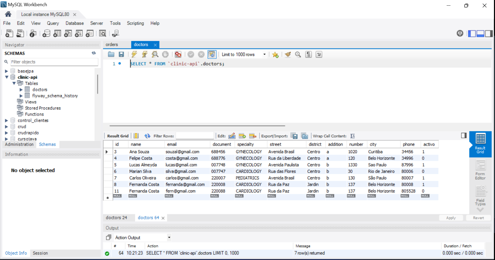
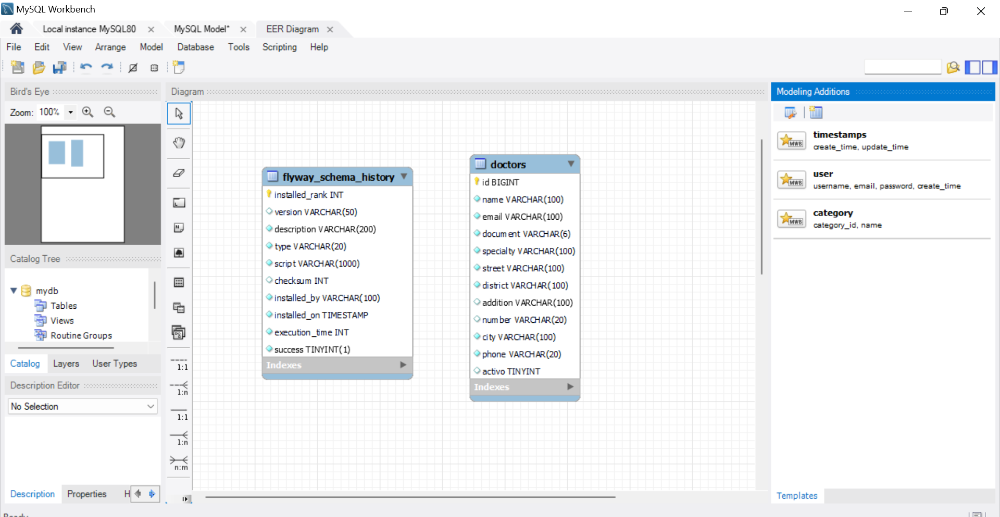

 <h1 style="text-align: center;"> Api Clinic 🏥</h1>


# Descripción 📖
El desarrollo de una API rest para una clínica permite registrar los datos de sus médicos: nombre, email, teléfono, documento, estado (activo/inactivo), especialidad y dirección, que contiene: calle, número, distrito, ciudad y adicional (categoría). Se realizó un borrado lógico para evitar perder datos en la base de datos, utilizando MySQL Workbench.
___ 

# Recursos:

| Plugin           | URL                      |
|------------------|--------------------------|
| spring-boot-starter-web | https://start.spring.io/ |
| spring-boot-devtools    | https://start.spring.io/ |
| lombok | https://start.spring.io/ |
| spring-boot-starter-data-jpa | https://start.spring.io/ |
| flyway-core | https://start.spring.io/ |
| flyway-mysql | https://start.spring.io/ |
| mysql-connector-j | https://start.spring.io/ |
| spring-boot-starter-validation | https://start.spring.io/ |
___
# Herramientas utilizadas 🛠️


&nbsp;
&nbsp;
&nbsp;
&nbsp;
&nbsp;
&nbsp;

&nbsp;&nbsp;&nbsp;&nbsp;&nbsp;&nbsp;&nbsp;&nbsp;&nbsp;[](LICENSE)&nbsp;&nbsp;&nbsp;&nbsp;&nbsp;&nbsp;
___


# Ejecutar el Proyecto ⚙️
1 - Clona el repositorio en tu máquina local
``` bash
git clone
<https://github.com/toby959/toby959-clinic.git>
```
2 - Compila y ejecuta el archivo ApiApplication.java.
___

# Funcionalidades 📦

Esta API REST permite cargar los datos de los médicos, evitando la duplicación de información. Se pueden guardar los datos de los médicos que se eliminan debido a un borrado lógico, que cambia el estado de 'activo' (1) a 'desactivo' (0). Además, se emplea Flyway, una herramienta de migración de bases de datos que facilita la gestión de cambios en la estructura de la base de datos a lo largo del tiempo.   
### Beneficios
Simplicidad: Facilita el manejo de migraciones sin necesidad de realizar cambios manuales en la base de datos.   
Trazabilidad: Ofrece un registro claro y accesible sobre el estado actual y el historial de las migraciones aplicadas.   
Integración: Se integra fácilmente con herramientas como Maven y Gradle, así como con frameworks como Spring Boot.   
___
## Uso de Postman
* Base de datos: Clinic request   
### Flexibilidad: Al usar una variable como {{url}}, puedes cambiar la URL base en un solo lugar (en la configuración del entorno) y todas las solicitudes que utilicen esa variable se actualizarán automáticamente. Esto es especialmente útil cuando trabajas con diferentes entornos (desarrollo, pruebas, producción) donde la URL puede variar.   

## Métodos: 
### POST 
- **Descripción**: Este método se utiliza para crear nuevos registros de médicos en la base de datos.
- **Endpoint**: `{{url}}/api/v1/doctors`
- **Cuerpo de la solicitud**:

````bash
{
    "name": "Fernanda Costa",
    "email": "fern@gmail.com",
    "phone": "805528",
    "document": "220088",
    "specialty": " CARDIOLOGY",
    "address": {
       "street": "Rua da Paz",
        "district": "Jardin",
        "city": "Belo Horizonte",
        "number": "137",
        "addition": "b"
    }
````
### GET
- **Descripción**: Este método trae una lista de médicos, según el uso de 'Page' usado para la paginación de los datos de DB, en este caso `@PageableDefault(size = 2)`.
- **Endpoint**: `{{url}}/api/v1/doctors`
- **Cuerpo de la solicitud**: vacio. 

### PUT
- **Descripción**: Este método permite modificar, nombre; documento y email del médico.
- **Endpoint**: `{{url}}/api/v1/doctors/5`
- **Cuerpo de la solicitud**:
````bash
{
    "id": 5,
    "name": "Lucas Almeyda",
    "document": "007748",
    "email": "lucas@gmail.com"
}
````

### DEL
- **Descripción**: Este método permite el borrado logico del médico.
- **Endpoint**: `{{url}}/api/v1/doctors/3`
- **Cuerpo de la solicitud**: vacio.
___ 

# Colaboraciones 🎯
Si deseas contribuir a este proyecto, por favor sigue estos pasos:

1 - Haz un fork del repositorio: Crea una copia del repositorio en tu cuenta de GitHub.  
2 - Crea una nueva rama: Utiliza el siguiente comando para crear y cambiar a una nueva rama:
```bash
git chechout -b feature-nueva
```
3 - Realiza tus cambios: Implementa las mejoras o funcionalidades que deseas agregar.  
4 - Haz un commit de tus cambios: Guarda tus cambios con un mensaje descriptivo:
```bash 
git commit -m 'Añadir nueva funcionalidad'
```
5 - Envía tus cambios: Sube tu rama al repositorio remoto:
````bash
git push origin feature-nueva
````
6 - Abre un pull request: Dirígete a la página del repositorio original y crea un pull request para que revisemos tus cambios.

Gracias por tu interés en contribuir a este proyecto. ¡Esperamos tus aportes!
___
# Imagenes:






___   

## Licencia 📜

Este proyecto está licenciado bajo la Licencia MIT - ver el archivo [LICENSE](https://github.com/toby959/toby959-clinic/blob/main/LICENSE) para más detalles.
